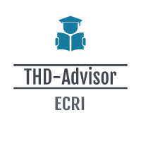

# THD-Advisor Forum 

For students in Rottal-Inn who look for information, the platform THD-advisor which is going hand-in-hand with local activities is the easiest, most collective and accessible digital space so they can find guidance through their daily life in Pfarrkirchen as well as administrative process of the campus because interacting with one another and commenting on the information ensures the validity and truth of data shared in the forum (additionally, it will be checked by an intermediate from the campus).​
## Requirements
- [composer: version 2.3.5](https://getcomposer.org/download/)
- [xampp: version v3.3.0](https://www.apachefriends.org/download.html)
- php: version 8.0.12
- mariaDB: version 10.4.21-MariaDB
### Setup:
1. Install all requirements.
2. Clone the repo: git clone https://github.com/FabianBenc/THDAdvisorLaravelProj.git
3. Open a terminal in a cloned repository and run command: `composer update`
4. Generate your local .env file with commands: 
>cp env.example .env

>php artisan key:generate
5. Open Xampp and start Apache and MySQL; In mySQL section click Admin to open up PHPMyAdmin;Create a new empty database by pressing the `New` button; **IMPORTANT you must name your database `laravel`**.
6. Run the migrations by exectuing the command `php artisan migrate`in your terminal.
7. Run the command `php artisan serve` to run the project; **open Development Server URL in your browser**.
